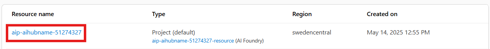
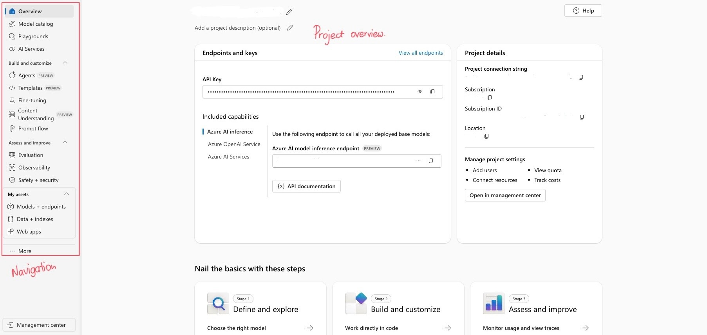
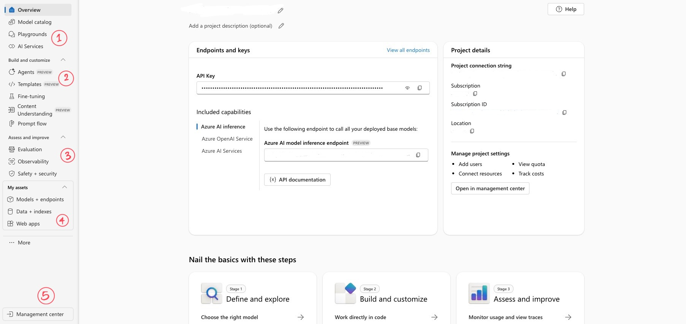
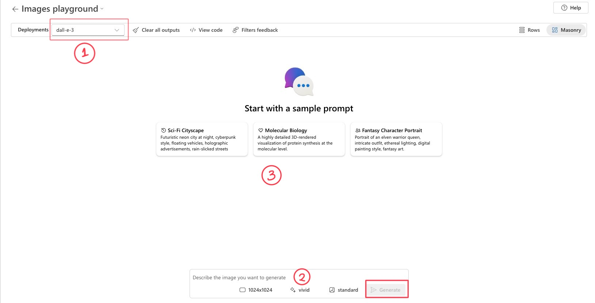

# Get started

> [!TIP]
> What is **Azure Azure AI Foundry**? Azure AI Foundry is the ultimate platform for innovators to create generative AI solutions. It offers a comprehensive suite of Azure AI capabilities and tools to design, customize, and manage AI applications and agents. It's seamlessly integrated with the world's most loved developer tools, including GitHub, Visual Studio, and Copilot Studio. Azure AI Foundry empowers developers and IT admins to bring their AI visions to life with ease and efficiency.

## Sign in to Windows
As a first step, login into the lab Virtual Machine using the following credentials:
- Username: already set to Admin.
- Password: enter +++@lab.VirtualMachine(Win11Base23B-W11-22H2).Password+++ and click.

> [!TIP]
>  First time using **Skillable?** The green "T" (e.g., +++Admin+++) indicates values that are automatically input for you at the current cursor location in VM, with one click. This reduces your effort and minimizes input errors.
> Also, you can always click on the images to enlarge them, if needed.

## Sign in to Azure AI Foundry portal
   
In this workshop we will be working on Azure AI Foundry portal, focusing especially on the playground feature. 

1. On the Desktop, click on **Microsoft Edge** browser. You'll get a browser tab with the Azure AI Foundry portal homepage as shown in the following image.

## Navigating Azure AI Foundry portal

1. Start by clicking **Sign In**, you can find the sign in link in the top right of the window, and enter the following credentials when prompted for the login credentials:
    -  Email: +++@lab.CloudPortalCredential(User1).Username+++
    -  Password: +++@lab.CloudPortalCredential(User1).Password+++

    Now that we are logged in, we can start navigating around the platform. 

2. Locate the +++@lab.CloudResourceTemplate(LAB324).Parameters[aiHubFriendlyName]+++ in the list of available hubs. **Click on the project** with the hub to access its settings and resources.

> [!NOTE]
> For the sake of this workshop an AI project with its related assets has been created for you, so you can focus on usage. Here's a list of resources that have been pre-provisioned in the workshop environment:
> - Azure AI Hub, which is your workspace in Azure AI Foundry and a container of projects. it comes with an Azure Key Vault and an Azure Storage 
> Account attached to store secrets and data.
> - Azure AI Project, which encapsulates the tools and assets used to create a specific AI solution
> - Azure AI Services, which provides access to generative AI models 
> - Azure AI Search, which enables advanced search capabilities

## Project

### Project Overview

On this page, we can see an overview of our Azure AI Foundry portal Project. This includes:
- **Project Name and Description**: The name of the project and a short description of the Azure AI Foundry portal Project we are in.
- **Project details**: A collection of various properties such as the Project's connection string, its location, resource group, etc. 
- **Endpoints and keys**: Azure AI Foundry portal allows for multiple resources to be connected to it, expanding its features and functionality. Resources such as Azure OpenAI, Azure AI Search and Azure AI Services further enhance the capabilities of our Project, granting us access to deployments such as LLMs or functionalities such as vector search.  Here we can find useful information such as *API endpoints and keys* and documentation.
- **Recent resources**: Once you deploy a model, connect data, or create any assets, they'll show up here, so you can always pick up where you left off.
- **Tutorials and examples to help you get started**: In this section, you can find useful learning resources and tutorials to help you get started.

### Navigation Bar

You will notice the navigation bar has updated with new tabs, which represent functionalities tied to our project.

We have two new sections:
1.  The first section includes _Overview_ which provides a general overview of your project, _Model Catalog_ which showcases the available models inside Azure AI Foundry, _Playgrounds_ to interact with the models, and _AI Services_ where you can see a list of Azure AI Services available along with demos, use cases and more.
1. **Build and Customize**: This includes useful opportunities to expand your project's reach, such as _working in Code_ by running a cloud compute, creating executable flows that link LLMs, prompts, and Python tools with _Prompt Flow_, and the ability to carry out _Fine Tuning_ on your deployments.
1. **Observe and Improve:** this includes _Evaluation_ processes for your applications, _Tracing_ to debug your flows and _content filters_ to add guardrails to prompt inputs and completion outputs.
1. **My assets**: Here you can add additional elements to the project, with resources such as _Data_, _Indexes_, _Models and endpoints_ and _Web apps_ to be used as part of your work.
1. **Management Center:** a location to manage all you  hub and project details and resources.

## Data and indexes

In this lab we are going to provide models access to a set of private data, to test their ability to ground responses. In this step, let's add this data in our Azure AI project. 

1. Navigate to **Data + Indexes**
2. Select, **New data,** and select **Upload files/folders** as **Data source**
        
3. Open the **Upload files or folder** dropdown, select **Upload folder** and upload the files hosted in the **product_catalog** folder on Desktop.
         
4. Once data is uploaded, name your data as **contoso-products** and finish.
5. Next, in the same tab, navigate to _Indexes_ and create an index for your data.
   - Move to the **Indexes** tab in the _Data + Indexes_ page.
   - Click on the **+ New index** button.
   - Select **Data in Azure AI Foundry** as the data source and then the data source you just uploaded.
        
   - In the **Index Configuration** section, change the default name of your Vector index to **products-catalog**. 
   - Open the dropdown menu for the Azure AI Search Service selection and then click on **Connect other Azure AI Search resource**.
        
   - A new window will be opened, where you can select the Azure AI Search resource that has been pre-provisioned for you. 
        
   - Back to the previous window, the **Select Azure AI Search service** dropdown menu has been populated with the new connection. Select it and then click **Next**.
        
   - In the **Search Settings** section, leave default configurations. Confirm by clicking on **Next**, and then click **Create vector index**.

Move to the next section as your data is being uploaded.

## Playgrounds

Click on **Playgrounds** in the left navigation. You will notice we have different options for our **Playground**. Each option represents a different approach to interacting and using AI models, which can be tailored to our specific needs.

We will be doing most of our work in these Playgrounds, but namely in the following:

1. **Chat Playground**
1. **Images Playground**
1. **Audio playground**
1. **Agents playground**

### Chat Playground

Within the playground section, navigate to the **Chat playground** and select **Try the Chat Playground.** This feature allows you to engage with and test various AI models in a conversational format.

1. **Deployment**: This section allows us to change between our deployed models.
1. **System Message Box**: Here is where we enter instructions for the model, previous to the user interaction.
1. **Add your data**: Azure AI Foundry portal supports providing the deployed models with external data, allowing for better search and context.
1. **Parameters**: This tab contains the models detailed settings, such as temperature.
1. **Chat Box**: The chat box is where we will see our interactions with the model in the form of chat messages.
1. **Prompt Box**: This is where we type the prompts we want to send to the model.

### Images Playground

Navigate back to Playgrounds, select the **Image playground** and click **Try the Image Playground.** This option allows you to work with image generation

1. **Deployments**: In this drop-down we are able to choose the model to prompt for image generation. These models, just like the chat ones, come from our deployments.
1. **Prompt Box**: Similar to the chat playground's box, this is where the models get their input from the user. In the case of images, descriptions of what we want to generate.
1. **Results Box**: Finally, here is where the generated images are displayed.

### Audio playground

Navigate back to Playgrounds, then select the **Audio playground** and click **Try the Audio Playground.** This feature allows you to engage with and test various AI models in an audio conversational format.

1. **Deployment**: This section allows us to change between our deployed models.
1. **System Message Box**: Here is where we enter instructions for the model, previous to the user interaction.
1. **Choose a voice**: gpt-4o-realtime offers a variety of voices to choose from with unique accents or tonal capabilities tailored to your liking.
1. **Server turn detection**: additional parameters to help optimize the model's efficiency and performance by improving voice activity detection.
1. **Parameters**: This tab contains the models detailed settings, such as temperature and max response.
1. **Prompt Button**: Similar to the chat playground's box, this is where the models get their input from the user. 

> !NOTE
> You need to click on **Enable microphone** to be able to use real-time audio as chat input.

## Agents playground

In the Navigation bar, select **Agents**. This feature provides you with the tools to build, test, and customize AI-driven agents.

Once you _create your first Agent_ you will see the UI components as follows:
1. **Agent id and name:** Here you can give your Agent a name.
1. **Deployment**: In this drop-down we are able to choose the model to prompt for image generation. These models, just like the chat ones, come from our deployments.
1. **Instructions Box:** Here is where we enter instructions for the model, previous to the user interaction.

4. **Knowledge:** Knowledge gives the agent access to data sources for grounding responses.
1. **Actions:** Enhance the agent's capabilities by allowing it to run various tools at runtime.
1. **Model settings**: This tab contains the models detailed settings, such as temperature and Top P.
1. **Prompt Box:** Similar to the chat playground's box, this is where the models get their input from the user. 

## Ready to start

That covers the necessary setup and basics of Azure AI Foundry portal. We will now move forward to begin interacting with the models. 
Click **Next** to proceed to the Text Generation section.
